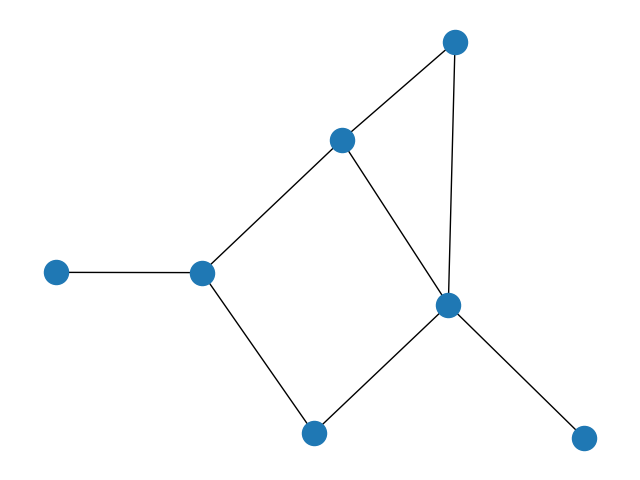
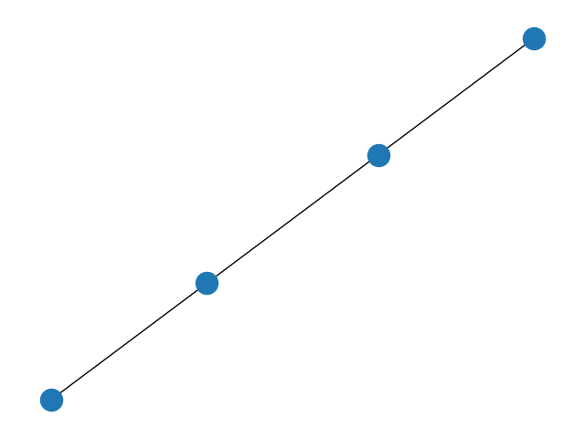
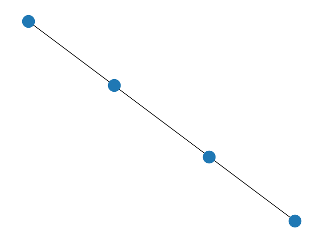

# make network graphs with python

## demo

## meta

general info:

 - https://www.python-course.eu/networkx.php
 - https://pypi.org/project/networkx/
 - https://networkx.org/documentation/stable/reference/introduction.html

